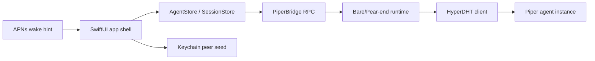

# iOS Networking Spike

## Summary

Piper's iOS app needs native iOS UX, Keychain, StoreKit, notifications, and background behavior, while the current open transport uses HyperDHT from the Holepunch ecosystem.

The recommended first implementation path is:

1. Build the app shell in native SwiftUI.
2. Store the iOS peer identity in Keychain.
3. Run the HyperDHT/Piper protocol client in a small Bare/Pear-end bridge.
4. Communicate between SwiftUI state and the bridge through a narrow RPC boundary.
5. Keep push notifications as wake hints, not command relay.

This keeps the product native while avoiding a premature rewrite of HyperDHT in Swift.

## Source Grounding

The official Pear docs describe Bare as a JavaScript runtime for desktop and mobile, with embedding and cross-device support as core use cases:

- https://docs.pears.com/reference/bare-overview.html

Pear docs also include a Bare mobile guide that uses a dedicated backend/Pear-end and RPC boundary between mobile UI and P2P code:

- https://docs.pears.com/guide/making-a-bare-mobile-app.html

HyperDHT's official docs describe direct key-addressed peer connections over the DHT, matching Piper's current instance-key model:

- https://docs.pears.com/howto/connect-two-peers-by-key-with-hyperdht.html
- https://github.com/holepunchto/hyperdht

The HyperDHT docs also note that some NAT combinations still require relay behavior outside HyperDHT's default direct path. Piper should keep that limitation visible in app connection states rather than hiding it:

- https://docs.pears.com/howto/connect-two-peers-by-key-with-hyperdht.html

## Architecture Direction

## Bridge Boundary

The bridge should expose a small command/event API:

- `createIdentity`
- `loadIdentity`
- `connectAgent(instanceKey)`
- `disconnectAgent(instanceKey)`
- `sendPrompt(instanceKey, text, streamingBehavior)`
- `sendSteer(instanceKey, text)`
- `abort(instanceKey)`
- `getState(instanceKey)`
- `getMessages(instanceKey)`
- `sendApproval(id, decision, reason)`
- `sendAuthResult(id, status, note)`

Bridge events should mirror `docs/protocol.md`:

- `hello`
- `presence`
- `event`
- `surface`
- `approval_request`
- `response`
- `connection_state`
- `error`

The Swift side should not know HyperDHT internals. It should know peer keys, connection states, request ids, and typed protocol messages.

## First Spike Milestones

1. Create a minimal SwiftUI app target. Done as an XcodeGen scaffold in `apps/ios/`.
2. Generate and persist a peer seed in Keychain. Started with a `PeerIdentityStore` protocol and in-memory dev implementation; Keychain implementation is a Mac follow-up.
3. Run a Bare/Pear-end bundle on iOS simulator.
4. From the bridge, connect to a local Piper testnet instance by public key.
5. Parse `hello` and `presence`.
6. Send `get_state` and correlate `response`.
7. Send one `prompt` or `steer` request.
8. Tear down cleanly when the app enters background or the user disconnects.

## Fallback Options

If the Bare bridge cannot satisfy App Store, backgrounding, or operational needs:

- Keep the SwiftUI app shell and replace the bridge with a native Swift transport implementation.
- Use a local network-only development bridge while implementing native HyperDHT pieces.
- Limit the first TestFlight to foreground P2P sessions and push wake hints until background behavior is proven.

Do not introduce a hosted command relay as a shortcut. That would violate Piper's trust model.

## Open Questions

- Can the Bare/Pear-end bridge be packaged cleanly for App Store review?
- How should the bridge expose logs and crash diagnostics without leaking agent content?
- What is the minimum background behavior iOS will allow before push wake hints are required?
- Can simulator tests run against `scripts/selftest.ts` style local bootstrap nodes?
- Does the bridge need a separate mobile protocol adapter, or can it share the TypeScript protocol DTOs directly?

## Verification Gate

Before building dashboard UI, U6 is not complete until one of these is true:

- A simulator app connects to a local testnet Piper instance and renders `hello`/`presence`.
- A documented fallback transport is chosen with enough proof to unblock app state work.

This gate prevents the app from accumulating polished UI on top of an unproven networking foundation.
