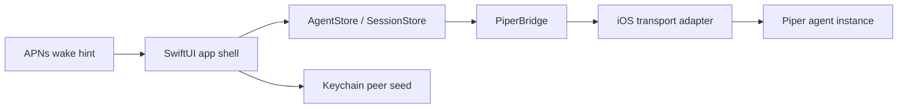

# iOS Networking Spike

## Summary

Piper's iOS app needs native iOS UX, Keychain, StoreKit, notifications, and background behavior, while the current open transport uses HyperDHT from the Holepunch ecosystem.

The app transport implementation is not chosen yet. The product commitment is a polished native iPhone app that feels reliable under normal mobile constraints; the transport must serve that product goal rather than force a fragile fully peer-to-peer mobile experience.

The current implementation path is:

1. Build the app shell in native SwiftUI.
2. Store the iOS peer identity in Keychain.
3. Keep SwiftUI state behind a narrow `PiperBridge` boundary.
4. Keep the JSONL protocol codec transport-agnostic.
5. Keep push notifications as wake hints, not command relay.

This keeps the product native while deferring the transport decision until it can be proven on macOS/iOS with App Store, backgrounding, reliability, and maintenance constraints in view.

## Source Grounding

Bare/Pear remains one candidate because the current open transport is JavaScript/Holepunch-native. It is not a product decision.

The official Pear docs describe Bare as a JavaScript runtime for desktop and mobile, with embedding and cross-device support as core use cases:

- https://docs.pears.com/reference/bare-overview.html

Pear docs also include a Bare mobile guide that uses a dedicated backend/Pear-end and RPC boundary between mobile UI and P2P code:

- https://docs.pears.com/guide/making-a-bare-mobile-app.html

HyperDHT's official docs describe direct key-addressed peer connections over the DHT, matching Piper's current instance-key model:

- https://docs.pears.com/howto/connect-two-peers-by-key-with-hyperdht.html
- https://github.com/holepunchto/hyperdht

The HyperDHT docs also note that some NAT combinations still require relay behavior outside HyperDHT's default direct path. Piper should keep that limitation visible in app connection states rather than hiding it:

- https://docs.pears.com/howto/connect-two-peers-by-key-with-hyperdht.html

## Architecture Direction

## Bridge Boundary

The bridge should expose a small command/event API:

- `createIdentity`
- `loadIdentity`
- `connectAgent(instanceKey)`
- `disconnectAgent(instanceKey)`
- `sendPrompt(instanceKey, text, streamingBehavior)`
- `sendSteer(instanceKey, text)`
- `abort(instanceKey)`
- `getState(instanceKey)`
- `getMessages(instanceKey)`
- `sendApproval(id, decision, reason)`
- `sendAuthResult(id, status, note)`

Bridge events should mirror `docs/protocol.md`:

- `hello`
- `presence`
- `event`
- `surface`
- `approval_request`
- `response`
- `connection_state`
- `error`

The Swift side should not know HyperDHT internals. It should know peer keys, connection states, request ids, and typed protocol messages.

The app scaffold includes `PiperWireCodec`, a transport-agnostic JSONL codec for these messages. Any real transport implementation should reuse that codec so SwiftUI state, tests, and the eventual network path share the same protocol boundary.

## First Spike Milestones

1. Create a minimal SwiftUI app target. Done as an XcodeGen scaffold in `apps/ios/`.
2. Generate and persist a peer seed in Keychain. Done in scaffold; still requires Mac validation.
3. Select and prove one iOS transport adapter.
4. From that adapter, connect to a local Piper testnet instance by public key.
5. Parse `hello` and `presence`.
6. Send `get_state` and correlate `response`.
7. Send one `prompt` or `steer` request.
8. Tear down cleanly when the app enters background or the user disconnects.

## Transport Candidates

The viable candidates are:

- Native Swift transport implementation.
- Embedded library or runtime that can carry HyperDHT reliably on iOS.
- Bare/Pear-end bridge, if packaging, backgrounding, and App Store review prove acceptable.
- Local network-only development bridge while implementing the production transport.
- Narrow service-assisted wake or rendezvous components that do not become command relay, protocol authority, or session store.

Do not introduce a hosted command relay as a shortcut. That would violate Piper's trust model and weaken the open protocol story.

## Open Questions

- Which iOS transport makes the official app feel most native, reliable, and maintainable?
- Can a Bare/Pear-end bridge be packaged cleanly for App Store review if we test it?
- Can a native Swift transport carry enough of HyperDHT without excessive rewrite risk?
- Is a narrow service-assisted approach needed for mobile reliability without centralizing commands?
- How should the bridge expose logs and crash diagnostics without leaking agent content?
- What is the minimum background behavior iOS will allow before push wake hints are required?
- Can simulator tests run against `scripts/selftest.ts` style local bootstrap nodes?
- Does the bridge need a separate mobile protocol adapter, or can it share the TypeScript protocol DTOs directly?

## Verification Gate

Before building dashboard UI, U6 is not complete until one of these is true:

- A simulator app connects to a local testnet Piper instance and renders `hello`/`presence`.
- A documented fallback transport is chosen with enough proof to unblock app state work.

This gate prevents the app from accumulating polished UI on top of an unproven networking foundation.
