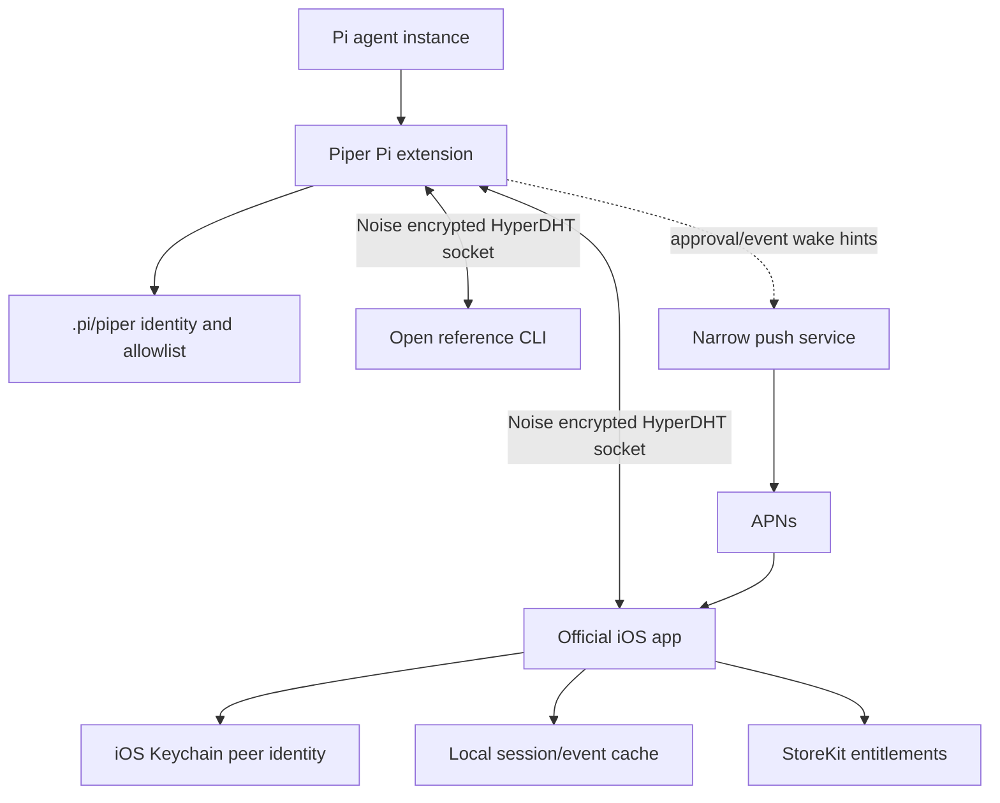

# Piper development roadmap from open transport to paid iOS product

## Summary

This plan turns Piper from the current HyperDHT transport extension into an open agent-control protocol plus a paid native iOS client. It excludes promotional websites and landing pages, and focuses on the full development pipeline: trustable open-source core, protocol hardening, approvals, notifications, mobile app, payments, distribution, and operational support.

---

## Problem Frame

Piper is a purpose-built control plane for persistent coding agents. The open-source layer should make agents addressable, pairable, steerable, and inspectable from anywhere without central relay infrastructure. The commercial layer should be the official iOS app: a polished mobile surface for monitoring progress, handling approvals, reviewing sessions, and intervening while away from a desk.

The current repo already proves the core v0 bridge: a Pi extension exposes a persistent HyperDHT identity, accepts allowlisted peers, forwards Pi events, accepts remote prompts, and has offline plus live test scripts. The roadmap now needs to move from proof to durable product.

Recent community research reinforces that the first adoption hurdle is trust rather than dashboard novelty. Self-hosters already assume dashboards, tmux wrappers, and mobile UIs can exist; the sharper question is what trust boundary makes a remote Codex or Claude runner acceptable. Piper should therefore present itself first as a secure remote-control and approval plane, then as the official iOS experience for that open protocol.

---

## Requirements

**Open protocol and transport**

- R1. Piper must keep the transport, identity, pairing, CLI tooling, and protocol documentation open source.
- R2. Each agent instance must remain addressable by a persistent public key created from local instance state under `.pi/piper/`.
- R3. Pairing must stay explicit and user-controlled, with no default trust in unknown peers.
- R4. The wire protocol must remain stable enough for third-party clients to implement without depending on the official iOS app.
- R5. The open client tooling must support pairing, connecting, prompting, steering, aborting, reading state, reading messages, and responding to approval requests.
- R6. The open docs must state the trust model, threat model, revocation path, and hosted-service boundaries before the paid app launch.

**Agent control surface**

- R7. A connected client must receive live presence, agent lifecycle events, message deltas, tool execution events, and terminal-safe error signals.
- R8. Remote prompts must preserve Pi's intended streaming behavior for new prompts, steering, and follow-ups.
- R9. Remote approvals must support allow, block, timeout behavior, and auditable decision context.
- R10. The product must support multiple persistent agents across machines without requiring static IPs, port forwarding, or a hosted relay.

**Official iOS product**

- R11. The official iOS app must provide agent dashboards, connection status, conversation views, approval workflows, push notifications, and session history.
- R12. The iOS app must make pairing understandable for technical users without weakening the public-key trust model.
- R13. The paid app must offer monthly, annual, and prominent lifetime purchase options.
- R14. Paid-app logic must not gate the open protocol; alternative clients must remain viable.
- R15. The mobile UX must prioritize away-from-desk workflows: monitoring, approvals, steering, review, and intervention.
- R16. The project must prove the iOS networking approach before UI-heavy app work depends on it.

**Quality and operations**

- R17. The project must have repeatable tests for protocol framing, allowlist behavior, pairing, transport, bridge behavior, app state, and purchase entitlement handling.
- R18. Release artifacts must include protocol docs, install docs, changelog notes, and migration guidance when the wire protocol changes.
- R19. The production path must avoid storing private agent secrets in any Piper-hosted service.
- R20. Any hosted component introduced for push notifications or receipt validation must be narrow, documented, and non-essential to protocol access.

---

## Scope Boundaries

**Included**

- Open-source Pi extension and transport hardening.
- Protocol documentation and compatibility policy.
- Improved terminal/reference manager client.
- Native iOS app for paid distribution.
- Push notification support for mobile workflows.
- App Store purchase and entitlement handling.
- Release engineering, documentation, and support paths.

**Deferred for later**

- Android app.
- Desktop app.
- Fleet-management web console.
- Hosted relay or cloud sync service.
- Organization/team administration.
- Multi-user shared agent ownership.

**Outside this plan**

- Promotional website and landing pages.
- SEO, acquisition funnels, and marketing experiments.
- Replacing Pi's core agent runtime.
- Making Piper a general SSH, remote desktop, or chat product.

---

## Key Technical Decisions

- KTD1. Open core, commercial client: The protocol, transport, CLI, and docs stay open because adoption is the infrastructure play; the official iOS app captures commercial value through experience quality.
- KTD2. Native SwiftUI app first: The paid product is iOS-only at launch because the unmet need is mobile, and native purchase, notification, backgrounding, and keychain integration matter more than cross-platform reuse.
- KTD3. The open protocol remains peer-addressed and encrypted: HyperDHT direct connectivity stays the open-core identity, while the official iOS app transport remains a product-quality implementation decision. Hosted components must not become command relay, protocol authority, or session store.
- KTD4. Protocol versioning before app scale: The wire schema needs explicit version negotiation and compatibility docs before multiple app releases depend on it.
- KTD5. Pairing remains manual and inspectable: QR codes and copy/paste can improve UX, but the security model remains public-key pairing with visible trust decisions.
- KTD6. Local-first session history: The iOS app should cache useful conversation and event history locally after connection, while the authoritative agent state remains with the agent instance.
- KTD7. Remote approvals are a first-class mobile flow: Approval requests need durable UI state and notifications, not just streamed text events.
- KTD8. Payments attach to the official app only: Entitlements unlock official app features and App Store distribution value, not network access or protocol permission.
- KTD9. Push is wake signaling, not command relay: The push service may register devices and deliver wake hints, but command, approval, and session data still flow over paired Piper connections.
- KTD10. Trust is the launch wedge: The first docs and app flows should answer "why should I trust this with my coding agent?" before they optimize for fleet-management breadth.

---

## High-Level Technical Design

The open-source repo should grow around three layers. The core layer owns identity, protocol framing, transport, trust, and Pi bridging. The reference-client layer proves the protocol and gives non-iOS users a usable manager. The product layer owns the native iOS app and narrow platform services for push and purchases.

Push notifications are the main exception to pure P2P. iOS cannot maintain arbitrary long-running peer sockets in the background, so the plan allows a minimal notification path that wakes the user to reconnect, approve, or inspect state. This service must not become the protocol authority, command relay, or session store.

---

## Implementation Units

### U1. Stabilize the open transport core

- **Goal:** Convert the current v0 proof into a durable library boundary for server, client, identity, allowlist, and protocol handling.
- **Files:** `src/transport.ts`, `src/protocol.ts`, `src/identity.ts`, `src/allowlist.ts`, `src/index.ts`, `test-peer/cli.ts`.
- **Patterns:** Keep `Transport` responsible for HyperDHT lifecycle and allowlist gating; keep Pi-specific behavior in `src/index.ts`.
- **Test Scenarios:** `scripts/selftest.ts` should cover allowlisted connection, rejected unpaired connection, broadcast delivery, malformed frame tolerance, disconnect cleanup, and multiple connected peers.
- **Verification:** `npm run typecheck`; `npm run selftest`.

### U2. Define protocol versioning and compatibility policy

- **Goal:** Document and enforce a stable protocol contract before mobile clients depend on it.
- **Files:** `src/protocol.ts`, `docs/protocol.md`, `docs/security.md`, `docs/compatibility.md`, `test-peer/cli.ts`.
- **Patterns:** Keep newline-delimited JSON framing; add explicit handling for unsupported protocol versions and unknown message types.
- **Test Scenarios:** Add protocol tests under `scripts/selftest.ts` or `src/protocol.test.ts` for version mismatch, unknown inbound messages, malformed JSON, CRLF framing, partial frames, approval response correlation, and oversized frames if a limit is introduced.
- **Verification:** Protocol docs match exported TypeScript message types; compatibility notes identify which changes require a version bump; security docs explain pairing, revocation, and hosted-service non-goals.

### U3. Upgrade the reference manager CLI

- **Goal:** Make the open CLI a credible reference implementation rather than only a throwaway peer.
- **Files:** `test-peer/cli.ts`, `README.md`, `docs/cli.md`.
- **Patterns:** Preserve the current persistent peer identity under the user's home directory; add commands without hiding the raw protocol behavior.
- **Test Scenarios:** CLI tests should cover identity creation, key display, target validation, prompt sending, approval response handling, reconnect messaging, and non-interactive command use where practical.
- **Verification:** A user can pair a peer, connect to an instance, request state, send a prompt, approve or block a tool, and exit cleanly from documented commands.

### U4. Harden Pi extension lifecycle and remote approvals

- **Goal:** Make the extension reliable during normal Pi sessions, shutdowns, model switches, long-running streams, and approval timeouts.
- **Files:** `src/index.ts`, `src/transport.ts`, `scripts/livetest.ts`, `scripts/tooltest.ts`.
- **Patterns:** Keep remote approvals opt-in until the UX is strong enough for default use; avoid blocking local sessions when no remote operator is connected.
- **Test Scenarios:** `scripts/livetest.ts` should cover prompt round trip, presence busy/idle, streamed assistant text, abort behavior, and message retrieval. `scripts/tooltest.ts` should cover allow, block, timeout-to-allow, disconnected peer during approval, and multiple connected peers receiving the same approval request.
- **Verification:** Live tests pass against the isolated `.pi/agent` environment when provider credentials are configured.

### U5. Build pairing UX primitives

- **Goal:** Support human-safe pairing flows for CLI and iOS without changing the trust model.
- **Files:** `src/allowlist.ts`, `src/index.ts`, `src/protocol.ts`, `docs/pairing.md`, `test-peer/cli.ts`.
- **Patterns:** Treat public keys as the source of trust; QR codes and short fingerprints are display helpers only.
- **Test Scenarios:** Tests should cover valid key add, invalid key rejection, duplicate add idempotence, corrupted allowlist fail-closed behavior, key removal if implemented, and fingerprint display consistency.
- **Verification:** Pairing docs show copy/paste and QR-based flows using the same underlying public keys.

### U6. Create the iOS app foundation

- **Goal:** Introduce a native app workspace with peer identity storage, connection state, agent list, and a small protocol client.
- **Files:** `apps/ios/PiperApp/`, `apps/ios/PiperApp/PiperApp.swift`, `apps/ios/PiperApp/Networking/`, `apps/ios/PiperApp/State/`, `apps/ios/PiperAppTests/`, `docs/ios-prd.md`, `docs/ios-networking-spike.md`.
- **Patterns:** Store the iOS peer secret in Keychain; model agent connections as explicit state machines; keep protocol DTOs close to `src/protocol.ts`.
- **Test Scenarios:** iOS tests should cover key generation persistence, agent address validation, connection state transitions, hello parsing, presence updates, response correlation, and local cache writes.
- **Verification:** The team has a documented HyperDHT-on-iOS proof, fallback choice, or bridge strategy before dashboard UI work begins. The app can connect to a local testnet Piper instance and render one agent's presence.

### U7. Implement mobile dashboard and session views

- **Goal:** Deliver the core away-from-desk experience: see agents, inspect current work, read streamed output, and send steering messages.
- **Files:** `apps/ios/PiperApp/Views/Agents/`, `apps/ios/PiperApp/Views/Session/`, `apps/ios/PiperApp/State/AgentStore.swift`, `apps/ios/PiperAppTests/SessionViewModelTests.swift`.
- **Patterns:** Optimize for scanning: compact agent status, current task, last activity, model, cwd, and connection health.
- **Test Scenarios:** Tests should cover empty state, offline agent, connected idle agent, busy agent with deltas, message history load, prompt send success, prompt send failure, and abort confirmation.
- **Verification:** A user can monitor one or more paired agents and steer a running task from the phone.

### U8. Implement approval workflows and notifications

- **Goal:** Make remote approvals reliable on mobile, including when the user is not staring at the app.
- **Files:** `src/protocol.ts`, `src/index.ts`, `apps/ios/PiperApp/Views/Approvals/`, `apps/ios/PiperApp/Notifications/`, `services/push/`, `docs/push-notifications.md`, `docs/privacy.md`.
- **Patterns:** Keep push payloads minimal and privacy-aware. Use push to wake the app and identify the agent or approval request, then fetch details over the paired Piper connection.
- **Test Scenarios:** Tests should cover device registration, registration revocation, approval request display, allow, block, timeout, app background notification handling, duplicate approval suppression, stale approval expiry, and reconnection after notification tap.
- **Verification:** With `PIPER_APPROVALS=remote`, a tool request can wake the iOS app, reconnect over Piper, receive allow/block, and continue or halt correctly.

### U9. Add local session history and multi-agent management

- **Goal:** Let the paid app remain useful across intermittent mobile connectivity.
- **Files:** `apps/ios/PiperApp/Persistence/`, `apps/ios/PiperApp/State/AgentRegistry.swift`, `apps/ios/PiperAppTests/PersistenceTests.swift`.
- **Patterns:** Cache events and messages locally on the device; do not require a hosted database for baseline use.
- **Test Scenarios:** Tests should cover local event append, message reconstruction from deltas, per-agent history isolation, cache pruning, corrupted cache recovery, and reconnect reconciliation.
- **Verification:** The app can reopen and show recent agent activity without an active socket, then reconcile when the agent reconnects.

### U10. Implement paid app entitlements

- **Goal:** Add the commercial layer while preserving open protocol access.
- **Files:** `apps/ios/PiperApp/Billing/`, `apps/ios/PiperApp/Settings/`, `services/receipts/`, `docs/pricing.md`.
- **Patterns:** Use StoreKit for monthly, annual, and lifetime products; keep lifetime prominent in the purchase UI.
- **Test Scenarios:** StoreKit tests should cover monthly active, annual active, lifetime active, expired subscription, restored purchase, failed purchase, offline entitlement cache, and receipt validation failure.
- **Verification:** Entitlement state unlocks official app features but does not alter any protocol permission or remote agent allowlist state.

### U11. Package open-source releases and contributor docs

- **Goal:** Make the open layer adoptable by people who never buy the iOS app.
- **Files:** `README.md`, `docs/install.md`, `docs/protocol.md`, `docs/pairing.md`, `docs/cli.md`, `docs/security.md`, `package.json`.
- **Patterns:** Separate open infrastructure docs from paid app docs; document threat model and limitations plainly.
- **Test Scenarios:** Documentation checks should verify commands, environment variables, and file paths remain accurate. Release checks should run typecheck, selftest, and any protocol tests.
- **Verification:** A fresh user can install the extension, pair the CLI, and drive an agent from the docs alone.

### U12. Prepare App Store release and support operations

- **Goal:** Ship the official paid app with enough operational structure to support real users.
- **Files:** `apps/ios/PiperApp/`, `docs/app-store-release.md`, `docs/support.md`, `docs/privacy.md`, `docs/security.md`.
- **Patterns:** Keep privacy claims aligned with architecture; avoid implying Piper stores or brokers agent content unless a later hosted feature actually does.
- **Test Scenarios:** Release validation should cover TestFlight install, clean first launch, purchase restore, pairing, foreground connection, background notification, approval flow, and upgrade from a prior build.
- **Verification:** The App Store submission has privacy labels, support contact, purchase products, screenshots, and a release checklist that matches shipped behavior.

---

## Development Pipeline

1. **Foundation:** U1 through U4 make the open core safe enough to build clients against.
2. **Trust and docs:** U2, U5, and U11 make the protocol understandable and implementable by others.
3. **Mobile alpha:** U6 and U7 produce a TestFlight app for mobile monitoring and steering over the selected Piper transport.
4. **Mobile beta:** U8 and U9 add approval notifications and resilient local history.
5. **Commercial beta:** U10 adds StoreKit products, entitlement state, and purchase restore.
6. **Launch hardening:** U11 and U12 prepare public open-source release, App Store release, support, and security posture.

---

## Acceptance Examples

- AE1. Given a fresh Pi project with Piper installed, when the extension starts, then it creates a persistent `.pi/piper/seed`, prints the instance public key, and listens on HyperDHT.
- AE2. Given an unpaired peer, when it attempts to connect, then the instance rejects the socket and does not expose state or events.
- AE3. Given a paired iOS app, when an agent starts streaming, then the app shows the agent as busy and appends streamed assistant text in order.
- AE4. Given a running task that requests tool approval, when the app receives the approval notification and the user taps Block, then the agent receives a block decision and the command does not run.
- AE5. Given the iOS app is offline, when the user opens an agent, then recent locally cached session history is visible with clear stale/offline state.
- AE6. Given a user buys the lifetime product, when the app is reinstalled and purchases are restored, then official app entitlement is restored without changing any agent pairing.
- AE7. Given a third-party client implements `docs/protocol.md`, when it uses a paired key, then it can connect and drive an instance without using the paid iOS app.

---

## System-Wide Impact

The trust boundary stays between paired public keys, not app accounts. The iOS app introduces a new peer identity that must be protected in Keychain and treated like an SSH key. Push and receipt services introduce hosted code, but they must not become required for base protocol access or store agent secrets. Protocol stability becomes more important once App Store users lag behind source releases.

Push registration creates a second relationship between an agent instance and an iOS installation. That relationship should be revocable from both ends and must not imply protocol trust unless the same public key is paired in `.pi/piper/allowed.json`.

---

## Risks & Dependencies

- **iOS background limits:** Direct P2P sockets will not behave like desktop daemons in the background. Mitigation: design push as wake-and-reconnect rather than always-on transport.
- **iOS transport fit:** The official app must feel like a polished native iPhone app, not a fragile transport demo. A native Swift client may need a bridge, embedded library, narrow service-assisted path, or a transport fallback if direct HyperDHT support is immature or mobile-hostile. Mitigation: prototype transport candidates before treating any one option as chosen.
- **Protocol drift:** Pi agent events may change as Pi evolves. Mitigation: version Piper's envelope and document which event fields are forwarded verbatim.
- **Approval safety:** Blocking local execution on remote decisions can frustrate users or create hangs. Mitigation: keep remote approvals opt-in until timeout and stale-state behavior are well tested.
- **App Store payments:** StoreKit and receipt validation add platform complexity. Mitigation: keep entitlement logic isolated from protocol permission logic.
- **Security expectations:** Public-key pairing sounds simple but users may misunderstand device trust. Mitigation: show fingerprints, paired devices, removal controls, and security docs early.

---

## Documentation and Operational Notes

- `README.md` should remain the entry point for the open extension and CLI.
- `docs/protocol.md` should be sufficient for alternative clients.
- `docs/security.md` should state what Piper protects, what it does not protect, and how pairing can be revoked.
- `docs/pricing.md` should capture monthly, annual, and lifetime positioning for the paid app.
- `docs/app-store-release.md` should hold the release checklist, privacy-label inputs, and TestFlight validation.
- `docs/support.md` should cover pairing failures, NAT/connectivity issues, lost devices, purchase restore, and notification troubleshooting.

---

## Sources and Existing Patterns

- `docs/ios-prd.md` captures the paid iOS app requirements.
- `docs/protocol.md` captures the current wire protocol and compatibility commitments.
- `docs/security.md` captures the current trust model, threat model, and hosted-service boundaries.
- `src/index.ts` currently bridges Pi session events, remote prompts, slash commands, and opt-in remote approvals.
- `src/transport.ts` currently owns HyperDHT lifecycle, allowlist gating, peer send, broadcast, and teardown.
- `src/protocol.ts` currently defines newline-delimited JSON framing and v0 message types.
- `src/identity.ts` currently persists the instance identity seed under `.pi/piper/seed`.
- `src/allowlist.ts` currently persists paired peer keys in `.pi/piper/allowed.json`.
- `test-peer/cli.ts` currently demonstrates a persistent manager identity and interactive prompting.
- `scripts/selftest.ts` currently verifies offline transport behavior over a local HyperDHT testnet.
- `scripts/livetest.ts` and `scripts/tooltest.ts` currently define the live bridge and approval coverage targets.
