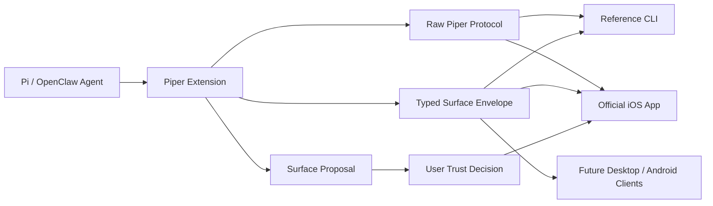

# Typed Agent Surfaces Plan

## Summary

Introduce a typed capability surface above Piper's raw message transport so Pi, OpenClaw, and future agent harnesses can send structured domain events, artifacts, approvals, metrics, and proposals without requiring Piper clients to hard-code every possible use case.

Piper remains, at its simplest, a secure peer-to-peer channel for sending and receiving messages. Typed agent surfaces make those messages more useful by giving them stable shape. A coding agent can report a git commit, an OpenClaw agent can report a life-management task, and an experiment runner can report a finding, while the iOS app renders each as native timeline items, cards, approval sheets, or detail views.

This is not a full UI plugin system and not complete agent malleability. Agents can enrich the information they send, declare capabilities, and request display/action affordances, but Piper clients keep control of rendering, permissions, privacy boundaries, and action execution.

## Problem Frame

Piper is being built for two primary user groups:

- Pi users: technical users running lightweight self-added agent extensions for coding workflows, remote monitoring, approvals, and steering from anywhere.
- OpenClaw users: more likely non-technical users whose agents manage personal or life workflows in the background, often through Pi as the core harness.

Both groups need the same transport primitives, but their useful event shapes diverge quickly. Pi users may care about commits, test results, branch state, approval prompts, and experiment logs. OpenClaw users may care about scheduled actions, new sales, messages sent, memory updates, task completion, or personal automations.

If Piper only forwards raw strings, the mobile app loses the chance to feel native and useful. If Piper tries to build bespoke UI for every domain, the app becomes unbounded and brittle. Typed agent surfaces are the middle path: a constrained, extensible set of message shapes that clients can render elegantly while preserving open protocol compatibility.

## Requirements

- R1: Preserve the current raw protocol. Existing prompt, steer, abort, state, messages, approval, presence, response, and event flows must remain backwards-compatible.
- R2: Add a typed surface envelope with stable fields for kind, type, id, timestamp, source, schema version, summary, payload, display hints, and fallback text.
- R3: Support an initial built-in surface set for events, artifacts, metrics, actions, approvals, and surface proposals.
- R4: Allow clients to ignore unsupported surface types and still render a safe generic fallback.
- R5: Allow agents/extensions to propose additional surface schemas without letting them inject arbitrary UI code.
- R6: Require explicit user approval before a proposed surface can gain elevated display treatment, persistent permissions, or executable action affordances.
- R7: Keep action and approval execution inside Piper's existing trust and approval model.
- R8: Apply data minimization by default: summaries and metadata should be preferred over large or sensitive payloads, with documented redaction and size limits.
- R9: Enable the official iOS app to render typed surfaces using native controls, including timeline cards, detail sheets, approval sheets, metrics, and artifact previews.
- R10: Keep the reference CLI useful by printing typed surfaces in readable fallback form and exposing raw JSON when needed for debugging.
- R11: Document the surface model, schema versioning, permission boundaries, and security risks before treating this as part of the public protocol.
- R12: Support remote authentication handoff flows where an agent can request user-assisted login, MFA, consent, or account selection without receiving raw credentials.
- R13: Ensure auth handoff flows are scoped, auditable, cancellable, and explicit about which agent, site, session, and action requested the authentication.

## Key Technical Decisions

- KTD1: Typed surfaces are a protocol layer, not a client-specific UI system. The protocol describes meaning and safe display hints; each client owns presentation.
- KTD2: Surface payloads must be structured data, not executable UI. No HTML, JavaScript, Swift snippets, or arbitrary native component definitions are accepted from agents.
- KTD3: Unknown surfaces degrade gracefully. Every surface must include a human-readable fallback so old clients and CLI tools can still show something useful.
- KTD4: Built-in surface schemas cover common agent work first: commit, test result, artifact, approval, metric, task, notification, experiment log, and generic event.
- KTD5: Extension-defined schemas use a manifest/proposal flow. An agent can ask for richer treatment, but the user and client decide whether to trust it.
- KTD6: Receiving structured data is lower risk than executing actions. Surface actions, destructive operations, and notification privileges require stricter consent than passive display.
- KTD7: The raw Pi/OpenClaw event stream remains available underneath typed surfaces for debugging, replay, and simple clients.
- KTD8: The iOS app should optimize for native comprehension, not configurability. It renders known shapes beautifully and unknown shapes safely.
- KTD9: Remote auth is a handoff, not credential sharing. Piper should help the user complete login or consent from afar while keeping passwords, passkeys, OAuth grants, and MFA secrets out of agent-visible payloads wherever possible.
- KTD10: Auth surfaces require stronger provenance than ordinary event surfaces. The client should show the requesting agent, peer identity, origin URL, target domain, requested scope, and session destination before the user proceeds.

## High-Level Design



The extension emits both raw events and typed surfaces where useful. Clients that understand a surface render it natively. Clients that do not understand it show fallback text, summary metadata, and optional raw payload inspection.

## Surface Envelope Sketch

```ts
type SurfaceEnvelope = {
  kind: "surface";
  surface: "event" | "artifact" | "metric" | "action" | "approval" | "proposal";
  type: string;
  id: string;
  ts: number;
  source: {
    agent?: string;
    harness?: "pi" | "openclaw" | string;
    session?: string;
  };
  schema: {
    version: number;
    url?: string;
  };
  summary: string;
  fallback: string;
  display?: {
    title?: string;
    subtitle?: string;
    priority?: "low" | "normal" | "high" | "critical";
    icon?: string;
    group?: string;
  };
  payload: Record<string, unknown>;
};
```

This shape is illustrative. The implementation should refine naming and validation against the existing `src/protocol.ts` style before shipping.

## Initial Built-In Schemas

- `git.commit`: commit hash, branch, repository, author, summary, changed files count, test status.
- `test.result`: command, status, duration, failed tests, logs artifact reference.
- `artifact.created`: artifact id, title, mime type, size, preview availability, origin task.
- `approval.request`: action summary, risk level, command or operation metadata, timeout, decision options.
- `metric.series`: label, value, unit, trend, time window, optional sparkline points.
- `task.update`: task id, title, state, progress, next action, blockers.
- `experiment.log`: hypothesis, run id, result summary, metrics, linked artifacts.
- `notification`: concise human-facing event for low-structure updates.
- `surface.proposal`: schema/type proposal, requested display treatment, permission rationale, sample payload.
- `auth.request`: agent request for user-assisted authentication, MFA, consent, account selection, or reauthentication.
- `auth.result`: non-secret result metadata indicating whether the handoff completed, failed, expired, or was cancelled.

## Implementation Units

### U1: Protocol Surface Types

Add typed surface definitions and outbound message variants.

Relevant files:

- `src/protocol.ts`
- `docs/protocol.md`
- `docs/surfaces.md`

Work:

- Define `SurfaceEnvelope` and initial surface variants.
- Add outbound `surface` message support while preserving current message types.
- Add basic validation expectations for required envelope fields.
- Document line-delimited JSON examples for known and unknown surfaces.

Acceptance:

- Existing protocol tests still pass.
- A known surface can be serialized and decoded.
- An unknown surface type still includes summary and fallback text.

### U2: Extension Surface Emission Path

Expose a minimal way for the Piper extension to emit typed surfaces alongside raw events.

Relevant files:

- `src/index.ts`
- `src/protocol.ts`
- `docs/protocol.md`

Work:

- Add an internal helper for broadcasting typed surfaces to connected peers.
- Keep current raw `event` broadcast behavior unchanged.
- Decide whether the first implementation is internal-only or exposed through a small command/API for Pi/OpenClaw integration.

Acceptance:

- A surface broadcast reaches all connected allowlisted peers.
- Raw events and typed surfaces can coexist in the same session.
- Unsupported peers are not disconnected by receiving a new surface message.

### U3: Reference CLI Fallback Rendering

Teach the reference CLI to display typed surfaces clearly without becoming a full UI.

Relevant files:

- `test-peer/cli.ts`
- `docs/cli.md`
- `docs/surfaces.md`

Work:

- Print known surfaces with concise human-readable labels.
- Print unknown surfaces using fallback text and optional raw JSON.
- Add CLI docs for observing typed surfaces during development.

Acceptance:

- A `git.commit` surface prints as a commit-style update.
- A `task.update` surface prints as a task-style update.
- An unknown surface prints fallback text and does not crash the CLI.

### U4: Surface Schema Documentation

Create the public contract for built-in and extension-defined surfaces.

Relevant files:

- `docs/surfaces.md`
- `docs/protocol.md`
- `docs/security.md`
- `docs/ios-prd.md`

Work:

- Document each built-in schema with field tables and examples.
- Document schema versioning and compatibility rules.
- Document when to use raw events versus typed surfaces.
- Add iOS rendering expectations to the PRD without tying the protocol to iOS.

Acceptance:

- A third-party client author can implement fallback rendering from the docs.
- A Pi/OpenClaw extension author can choose an appropriate built-in schema.
- The docs explicitly forbid arbitrary UI/code injection.

### U5: Capability Proposal and Permission Model

Design and implement the first version of agent-declared surface capabilities.

Relevant files:

- `src/protocol.ts`
- `src/index.ts`
- `docs/surfaces.md`
- `docs/security.md`

Work:

- Define `surface.proposal` as an inert message type.
- Specify what a proposal can request: schema name, sample payload, display treatment, notification behavior, and action affordances.
- Require user approval before elevated display, persistent notification privileges, or action execution.
- Persist approval state only after the storage model for trusted agent capabilities is defined.

Acceptance:

- A proposal can be received and displayed without granting permissions.
- Action-capable proposals are clearly distinguished from passive display proposals.
- Rejected or unknown proposals do not alter client behavior.

### U6: iOS Native Rendering Contract

Translate typed surfaces into native iOS product behavior.

Relevant files:

- `docs/ios-prd.md`
- `docs/ios-surfaces.md`
- `docs/surfaces.md`

Work:

- Define native render patterns for cards, timeline rows, approval sheets, metrics, artifact previews, and fallback views.
- Define notification behavior for priority levels.
- Define empty, error, unknown, and redacted states.
- Keep the app as the commercial wrapper around open core functions, not the owner of the protocol.

Acceptance:

- The iOS PRD describes how each initial surface appears.
- Unknown surfaces have a native fallback state.
- Privacy and redaction states are represented in the UX model.

### U7: Integration and Self-Test Coverage

Add tests for typed surfaces across decoder, transport, and reference client behavior.

Relevant files:

- `scripts/selftest.ts`
- `src/protocol.ts`
- `test-peer/cli.ts`

Work:

- Extend selftest coverage for known surface frames.
- Cover unknown surface fallback requirements.
- Cover malformed, oversized, and missing-required-field payloads.
- Verify that surface broadcasts reach multiple connected peers.

Acceptance:

- `npm run typecheck` passes.
- `npm run selftest` passes.
- Surface support does not regress pairing, revocation, prompt, steer, abort, or approval flows.

### U8: Remote Authentication Handoff

Design the first version of an auth handoff flow for agents blocked on browser login, MFA, OAuth consent, or account selection.

Relevant files:

- `src/protocol.ts`
- `src/index.ts`
- `docs/surfaces.md`
- `docs/security.md`
- `docs/ios-prd.md`

Work:

- Define `auth.request` and `auth.result` surfaces.
- Specify supported request modes: open URL for user login, approve OAuth consent, complete MFA challenge, choose account, and refresh expired session.
- Specify prohibited payloads: raw passwords, passkeys, one-time codes, long-lived cookies, refresh tokens, and bearer tokens.
- Define how the user sees the requesting agent, target domain, session destination, requested capability, expiry, and cancellation controls.
- Define the minimum viable implementation path: the user completes auth on their own device, and Piper returns only completion status or a short-lived handoff confirmation.
- Defer any richer browser session transfer until there is a reviewed security design.

Acceptance:

- An agent can request auth assistance without blocking silently.
- The iOS app can present the request as a native, high-trust workflow.
- The user can approve, complete, cancel, or reject the auth request remotely.
- The agent receives only non-secret completion metadata unless a later security-reviewed design permits more.
- Auth handoff is logged as an auditable session event.

## Acceptance Examples

- A Pi coding agent completes a task and sends `git.commit`; iOS shows a native commit card with repository, branch, hash, summary, changed files, and test status.
- An OpenClaw agent completes a personal automation and sends `task.update`; iOS shows a timeline row with status, next action, and a safe detail view.
- An agent emits `experiment.log`; iOS shows a structured log card with hypothesis, result, metric summary, and linked artifacts.
- A commerce-related agent sends a `notification` or domain-specific `workflow.sale`; old clients show fallback text while newer clients render a sale-style card if trusted.
- An agent reaches a login wall in its browser session and sends `auth.request`; iOS shows the requesting agent, target domain, reason, expiry, and a native handoff flow for the user to complete remotely.
- An agent proposes `custom.inventory.low_stock`; Piper shows the schema proposal and sample payload, but no special rendering or action is enabled until the user approves it.
- A malicious or confused agent sends a surface with unsupported type and embedded markup; clients ignore markup, show fallback text, and treat the payload as inert data.

## Risks

- Surface creep: the schema set could expand into a half-designed app platform. Keep the built-in set small and focused on common agent workflow primitives.
- Security confusion: users may assume structured cards are trustworthy. Clearly show source, agent identity, and action risk.
- Data exfiltration: richer payloads may leak more personal or repository data. Require payload limits, redaction guidance, and cautious defaults.
- Schema fragmentation: every extension could invent its own names. Prefer built-ins, document naming conventions, and require proposals for elevated treatment.
- Client divergence: iOS, CLI, and future clients may interpret surfaces differently. Keep the envelope strict and make fallback rendering mandatory.
- Over-customization: too many display hints could become arbitrary UI by another name. Keep hints semantic and client-owned.
- Auth leakage: remote auth could accidentally expose credentials, tokens, cookies, or account access to the agent. Treat auth handoff as a high-risk surface with explicit prohibitions and conservative metadata-only results.
- Phishing/confused deputy risk: an agent could ask the user to authenticate to the wrong site or for the wrong scope. Clients must display origin, domain, scope, requester, and session destination clearly.

## Open Questions

- Should surface capability approvals be stored per peer identity, per agent identity, per harness, or per session?
- Which built-in schemas are required for the first paid iOS release, and which can wait?
- Should payload schemas be JSON Schema, TypeScript-shaped documentation, or a simpler protocol-native schema format?
- How much raw payload inspection should be exposed to non-technical OpenClaw users?
- Should notification privileges be granted per surface type, per priority, or per agent?
- Can the first auth handoff be useful with metadata-only completion, or does Piper eventually need a secure browser/session transfer mechanism?
- Should auth requests be allowed for any domain, or limited by per-agent/domain trust grants?

## Sources and Existing Patterns

- `src/protocol.ts`: current message envelope and decoder behavior.
- `src/index.ts`: current extension command handling, pairing, and peer broadcast paths.
- `test-peer/cli.ts`: reference client behavior for state, messages, prompt, steer, and approvals.
- `docs/protocol.md`: public wire protocol documentation.
- `docs/security.md`: trust model, pairing, revocation, approvals, and push boundaries.
- `docs/ios-prd.md`: paid iOS app product requirements.
- `docs/research-notes.md`: recent research on persistent coding agents, mobile control, approvals, and adjacent tools.
